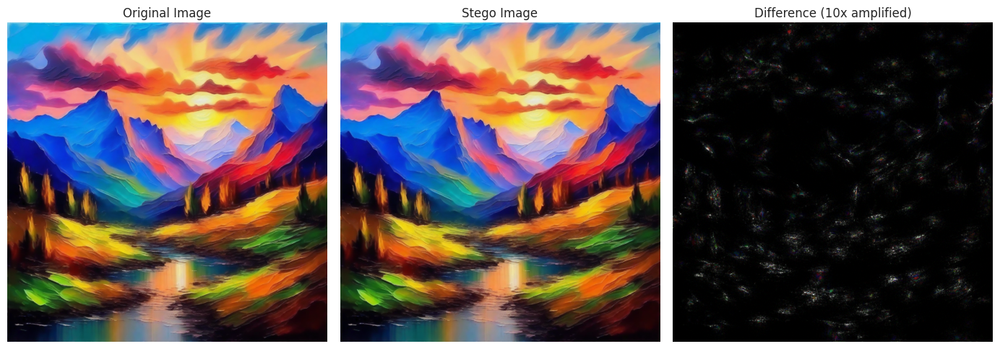

# LDStega: Unofficial PyTorch Implementation

 

Unofficial implementation of **"LDStega: Practical and Robust Generative Image Steganography based on Latent Diffusion Models"** — Jiang et al., [ACM MM 2024](https://dl.acm.org/doi/10.1145/3664647.3681635).

**Read [WRITEUP.md](WRITEUP.md) before using this code.**

This is not an official release — results diverge significantly from the paper's claims. The ~99% bit accuracy was not reproduced across any model or parameter setting. Performance is also highly seed-dependent (>10% std at 1024-bit payloads).



---

## How it works

Secret bits are embedded into diffusion-generated images by manipulating latent values at the final DDIM step. For each latent position, a discrepancy score $D = |Z_T − Z'_T|$ is computed by round-tripping the decoded image back through the VAE — positions with low discrepancy are the most stable across image transforms and are used first. Bits are encoded by sampling from a truncated Gaussian: bit 0 pulls the latent below the predicted mean, bit 1 pushes it above. The receiver decodes by re-running the same diffusion process with the same seed and prompt, then reading the sign of each modified latent relative to the mean.

## Results

The theoretical capacity and near-zero BER claimed in the paper were not reproduced. See [WRITEUP.md](WRITEUP.md) for a full experiments discussion and hypotheses on why.

---

## Supported / Tested models

| Model | HuggingFace ID | Latent Space Size |
|-------|---------------|-------------------|
| LDM | `CompVis/ldm-text2im-large-256` | 32×32×4 |
| Stable Diffusion 1.5 | `runwayml/stable-diffusion-v1-5` | 64×64×4 |
| Stable Diffusion 2.1 | `stabilityai/stable-diffusion-2-1` | 64×64×4 |
| SDXL | `stabilityai/stable-diffusion-xl-base-1.0` | 128×128×4 |

---

## Installation

```bash
git clone https://github.com/a3agalyan/ldstega-unofficial
cd ldstega-unofficial
pip install -e .
```

---

## Quick start

```python
from ldstega import LDStega, StegoConfig

config = StegoConfig(model_id="runwayml/stable-diffusion-v1-5", truncation_gamma=0.3)
stega = LDStega(config)

secret = LDStega.text_to_bits("I love steganography!!!")
stego_image = stega.encode("a sunset over mountains", secret_bits=secret, seed=42)

recovered = stega.decode(stego_image, "a sunset over mountains", message_length=len(secret), seed=42)
print(LDStega.bits_to_text(recovered))
```

```bash
# Benchmark against messenger-style attacks
python benchmark_ldstega.py --suite messenger --seeds 42,123,777
```

---

## Benchmarking

The benchmark library covers seven test suites:

| Suite | Description |
|-------|-------------|
| `individual` | 60+ isolated transforms (JPEG, resize, blur, noise, color jitter, crop, rotation) |
| `messenger` | Composite pipelines: Telegram, WhatsApp, Instagram, WeChat, double-JPEG, screenshot |
| `param_sweep` | gamma × message length grid under JPEG q=75 |
| `stress` | Extreme attacks: JPEG q=10, 4× downscale, heavy blur+noise, all combined |
| `transfer_format` | 6 transfer formats × 4 gammas × 5 message lengths |

```bash
python benchmark_ldstega.py --suite individual --seeds 42
python benchmark_ldstega.py --suite messenger --seeds 42,123,777
python benchmark_ldstega.py --suite param_sweep --seeds 42
python benchmark_ldstega.py --suite stress --seeds 42
python benchmark_ldstega.py --suite transfer_format --seeds 42
python benchmark_ldstega.py --suite all --seeds 42,123,777 --output-dir results/full
```

Results are written incrementally to CSV and JSON in the output directory — safe to interrupt and resume.

---

## Notebooks

See [notebooks/README.md](notebooks/README.md) for a guide to the two included notebooks.

---

## Repository layout

```
ldstega-unofficial/
├── ldstega.py             # Core implementation: LDStega, StegoConfig
├── benchmark_ldstega.py   # CLI benchmark runner
├── benchmark/             # Test suites, transforms, metrics, orchestration
└── notebooks/
    ├── 01_demo.ipynb                  # Encode/decode walkthrough
    └── 02_bit_accuracy_analysis.ipynb # Statistical analysis of results
```

---

## Citation

If you build on this work, please cite the original paper:

```bibtex
@inproceedings{jiang2024ldstega,
  title     = {LDStega: Practical and Robust Generative Image Steganography based on Latent Diffusion Models},
  author    = {Jiang, Yuwei and Li, Zhongliang and Qian, Zhenxing},
  booktitle = {Proceedings of the 32nd ACM International Conference on Multimedia},
  year      = {2024},
  doi       = {10.1145/3664647.3681635}
}
```

If you use this specific implementation:

```bibtex
@software{agalyan2025ldstega,
  title  = {LDStega: Unofficial PyTorch Implementation},
  author = {Agalyan, Armin},
  year   = {2026},
  url    = {https://github.com/a3agalyan/ldstega-unofficial}
}
```
