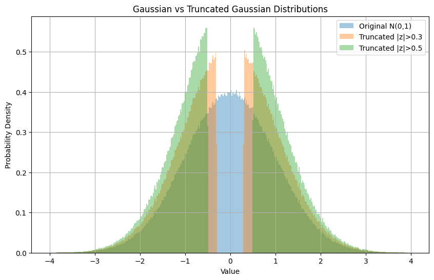
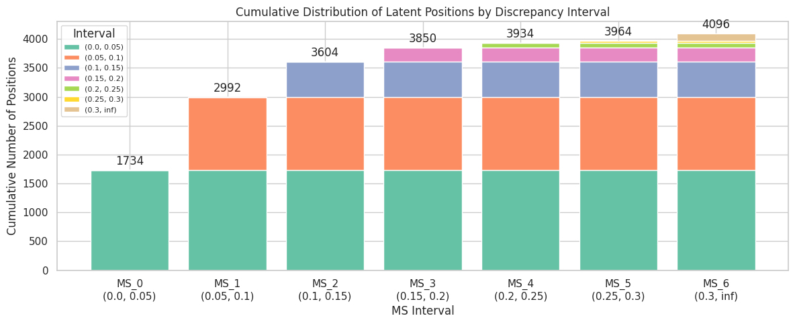
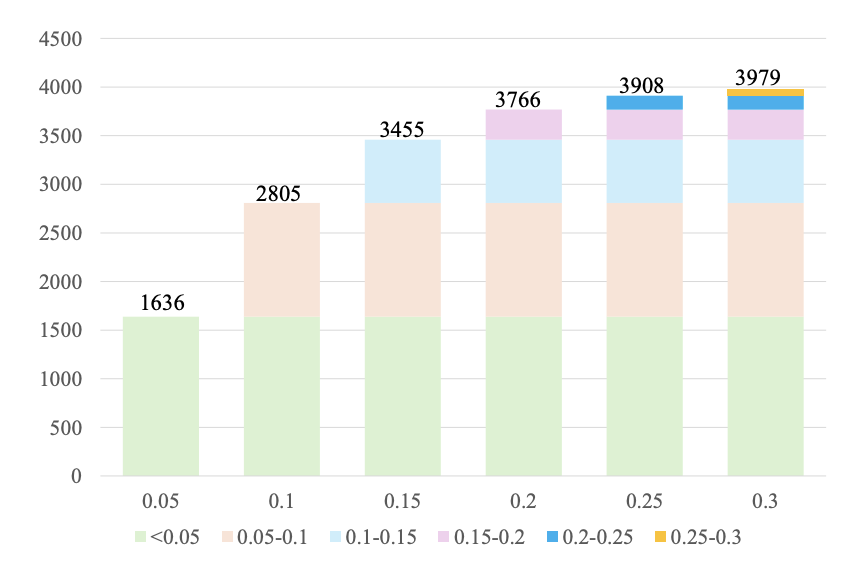
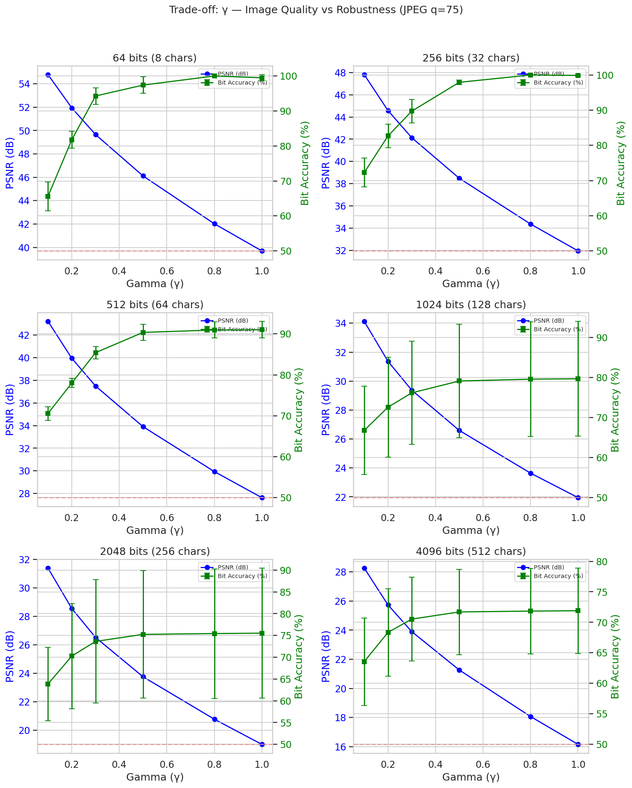
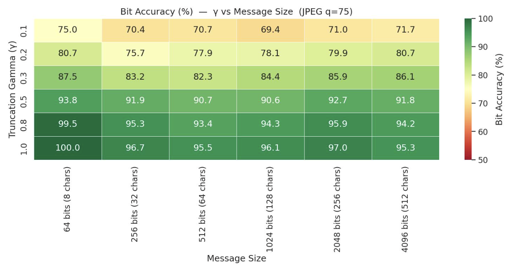

## TLDR:
My aim was to replicate the algorithm described in the paper, but could not achieve similar results. The same level of accuracy was not achieved at any parameter sweep, and the method demonstrates considerable instability across different seeds — over 10% std of accuracy for 1024-bit length. 

Authors do not state the exact model they used, so exact replication is not possible. the paper's reported latent space (32×32×4, 256×256 images) is consistent with `CompVis/ldm-text2im-large-256`, though no model is named. I set aside the original benchmark dataset, as the primary objective was to validate the method itself, not to reproduce benchmark scores.

## What authors did:
They used LDM to embed secret bits into diffusion-generated images by manipulating latent values at the final DDIM step Z_T. To address the robustness of steganography, a parameter with a truncated interval $\gamma$ is used to ensure robust extraction (`bit accuracy`) and visual quality (`PSNR`).

## What authors discovered:
The main idea behind the paper is that doing a VAE-roundtrip: 
$$
Z_T \rightarrow \text{encode to pixels} \rightarrow \text{PNG/JPEG compression} \rightarrow \text{decode to latent space} \rightarrow Z'_T
$$
then calculating discrepancy score $D = |Z_T − Z'_T|$ allows you to find stable positions favourable for decoding. The idea is that by embedding secret bits into the most stable coordinates we can minimize payload data loss caused by the reconstruction of the latent space and the lossy transmission of the stego image.

Message hiding is controlled by truncation parameter $\gamma$ that defines the sampling interval of truncated Gaussian distributions guided by secret data
$(-\infty,\mu_{T-1}-\gamma)$ and $(\mu_{T-1}+\gamma,+\infty)$. Then driven by the secret data, one candidate pool is selected as the sampling interval.

LDStega leverages the Gaussian distribution property of $Z_T$ to hide the encrypted data. The idea is to mimic the original Gaussian distribution with a subtle truncated distribution. For $\gamma \leq 0.3$ the paper states this to be the optimum balance of robustness with no visual degradation. The paper claims ~99% bit accuracy at $\gamma = 0.3$.

## What I discovered:

I rigorously tested my implementation across different models, multiple seeds for stability, different message lengths, and compression attacks including JPEG compression at Q95 / Q85 / Q75 / Q60 / Q50 (see [Setup](#setup) for details).

Authors do not state the exact model they used, however one may reasonably expect consistent behavior across LDM-family models under this setup. However, I discovered that the accuracy heavily correlates with latent size.

The following models were tested:

| Model | HuggingFace ID | Latent Space Size |
|-------|---------------|-------------------|
| LDM | `CompVis/ldm-text2im-large-256` | 32×32×4 |
| Stable Diffusion 1.5 | `runwayml/stable-diffusion-v1-5` | 64×64×4 |
| Stable Diffusion 2.1 | `stabilityai/stable-diffusion-2-1` | 64×64×4 |
| SDXL | `stabilityai/stable-diffusion-xl-base-1.0` | 128×128×4 |

### Stable coordinates Latent discrepancy
Observed number of elements in discrepancy $ D = Z'_T - Z_T $
that fall in each of these
six intervals does match with those stated in the paper. However, it seems like they do not remain the same across different round-trips. I propose it as a major reason of low recovery accuracy.

| My experiment | Paper reference |
|-------------|-------------|
|  |  |

### Optimal $\gamma$
$\gamma$ controls a trade-off between PSNR (visual quality) and bit accuracy (robustness): lower $\gamma$ yields better image quality but weaker extraction, while higher $\gamma$ improves bit accuracy at the cost of perceptual fidelity. The paper identifies $\gamma$ ≈ 0.3 as the optimum balance point. 
In my experiments I achieved a similar optimum at $\gamma$ = 0.3.

### Overall quality results
SDXL showed the most promising results, but even they are far from what is stated in the paper. The best result achieved was ~93% bit accuracy, compared to the paper's claimed ~99%.

### Seed instability
A significant finding not discussed in the paper is the high variance across random seeds (see [vertical error bars indicate the variance](images/gamma_optimum.png)). For 1024-bit payloads, standard deviation of bit accuracy exceeded 10% across seeds, making reliable extraction non-deterministic in practice.

## Final thoughts
Three main findings emerged from this replication attempt:
- **Accuracy falls short**: The paper's claimed bit accuracy was not reproduced at any parameter setting across all four tested models.
- **Optimal γ is reproducible**: The γ ≈ 0.3 sweet spot for the robustness/quality tradeoff was consistently observed.
- **High seed variance**: Over 10% standard deviation in bit accuracy across seeds undermines the reliability of the method as presented.

My most likely explanation for the accuracy gap is that the paper used a specific model that is not publicly identified, making faithful replication impossible.

## Setup
The benchmark was structured into five suites:

**Individual transforms** — each attack in isolation at varying intensity:
- JPEG compression at Q95 / Q85 / Q75 / Q60 / Q50
- WebP compression at Q90 / Q75 / Q50
- Resize (downscale then upscale) at ×0.9 / ×0.75 / ×0.5 / ×0.25
- Gaussian blur (kernel 3–11, σ 0.5–3.0)
- Gaussian noise (σ 0.005–0.1)
- Brightness / contrast / saturation jitter
- Center crop (ratio 0.7–0.95) and rotation (1°–10°)

**Messenger platform pipelines** — chained transforms simulating real-world sharing:

| Platform | Pipeline |
|----------|----------|
| Telegram | resize ×0.75 → JPEG Q85 |
| WhatsApp | resize ×0.5 → JPEG Q60 → brightness +0.03 |
| Instagram | resize ×0.7 → JPEG Q75 → brightness/saturation jitter |
| WeChat | resize ×0.75 → JPEG Q70 → blur σ=0.5 |
| Double JPEG | JPEG Q85 → JPEG Q70 |
| Screenshot | blur σ=0.3 → resize ×0.9 → JPEG Q90 → quantize 64 levels |

**Parameter sweep** — γ ∈ {0.1, 0.2, 0.3, 0.5, 0.8, 1.0} × message length ∈ {256, 512, 1024, 2048, 4096} bits, all under JPEG Q75.

**Stress tests** — extreme attacks to locate breaking points: JPEG Q10, resize ×0.25, heavy blur (kernel 11, σ=3.0), heavy noise (σ=0.1), and all four combined.

**Transfer format sweep** — image transfer format ∈ {none, PIL, PNG, JPEG Q95/Q75/Q50} crossed with the same γ and message-length grid, to isolate the effect of the encode–decode round-trip on D-score stability.

Each configuration was run across seeds 42, 123, and 777. Metrics collected per run: bit accuracy, BER, PSNR, and SSIM (both stego vs. original and post-attack vs. original).